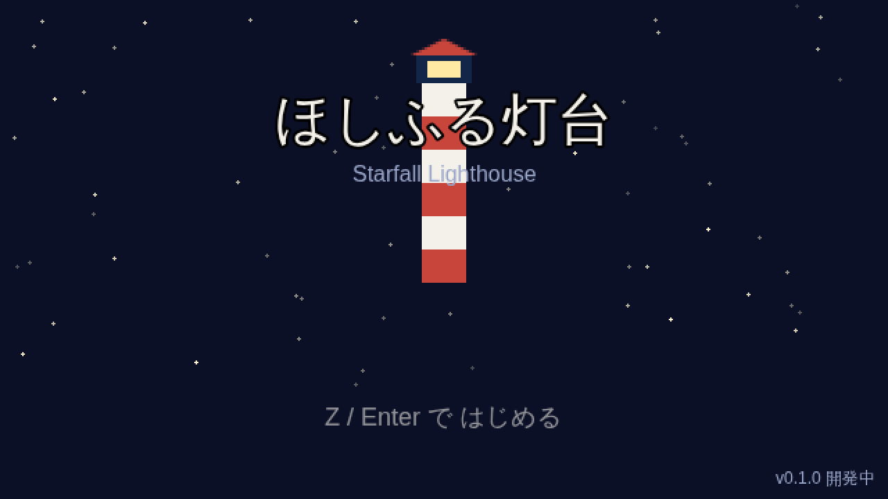

# ほしふる灯台 — Starfall Lighthouse

[](https://github.com/nakano0328/starfall-lighthouse/actions/workflows/ci.yml)
[](https://github.com/nakano0328/starfall-lighthouse/actions/workflows/deploy.yml)
[](LICENSE)

消えた灯台の光を取り戻すため、島に散った三つの星の欠片を集める、短くて優しい王道 JRPG。
海辺の小さな島「ミナト島」を舞台に、灯台守の見習い**ルカ**、幼なじみの**ミオ**、元鉱夫の**ゴロー**の三人が、迷い星が魔物となって徘徊する島を旅します。2D トップビュー・ターン制コマンドバトルの SNES 期 JRPG 風で、1.5〜2 時間でクリアできるコンパクトな一本。ブラウザだけで遊べます（インストール不要・日本語のみ）。

## 遊ぶ

公開 URL: **<https://nakano0328.github.io/starfall-lighthouse/>**

> リポジトリの Settings → Pages で Source を「GitHub Actions」に設定し、`main` への push で `deploy.yml` が一度走ると公開されます。それまでは上記 URL は 404 になります。



### 操作方法

| 操作           | キーボード        | 備考                                      |
| -------------- | ----------------- | ----------------------------------------- |
| 移動・カーソル | 矢印 / WASD       | 4 方向グリッド移動（Phase 2 で実装）      |
| 決定・調べる   | Z / Enter / Space | タイトル画面ではクリック／タップでも可    |
| 戻る・メニュー | X / Esc           | フィールドではメニューの開閉              |
| ゲームパッド   | —                 | 標準マッピングで対応予定（Phase 5）       |
| タッチ操作     | —                 | スマホ向け仮想パッドを表示予定（Phase 5） |

詳細な操作一覧は `docs/GAME_DESIGN.md` §11.4 を参照してください。

## 開発

### 必要環境

- Node.js 22（`.nvmrc` 参照。nvm なら `nvm install` で導入、以後は `nvm use` で切り替え可）
- npm（Node に同梱）

### セットアップ

```bash
npm ci
npm run dev
# → http://localhost:5173 で待ち受けます（ポート固定。ブラウザは手で開く）
```

### スクリプト一覧

| コマンド                | 内容                                                                     |
| ----------------------- | ------------------------------------------------------------------------ |
| `npm run dev`           | Vite 開発サーバーを起動（<http://localhost:5173>、HMR 有効）             |
| `npm run build`         | 本番ビルドを `dist/` に出力                                              |
| `npm run preview`       | `dist/` をローカル配信して確認（<http://localhost:4173>）                |
| `npm run typecheck`     | `tsc --noEmit` で型チェック                                              |
| `npm run lint`          | ESLint でソースを検査                                                    |
| `npm run lint:fix`      | ESLint の自動修正を適用                                                  |
| `npm run format`        | Prettier でリポジトリ全体を整形                                          |
| `npm run format:check`  | Prettier の整形差分を検査（CI で実行）                                   |
| `npm run test`          | Vitest で単体テストを一度実行                                            |
| `npm run test:watch`    | Vitest をウォッチモードで起動                                            |
| `npm run test:coverage` | 単体テストをカバレッジ付きで実行（`coverage/` に出力、閾値あり）         |
| `npm run e2e`           | Playwright でビルド → preview → 起動スモークテスト                       |
| `npm run check`         | lint → format:check → typecheck → test → build をまとめて実行（PR 前に） |

E2E はローカルに Chromium が必要です。初回は `npx playwright install --with-deps chromium` を実行してください。
ブラウザのダウンロードが制限されたサンドボックスでは、既存バイナリを指定して実行します。

```bash
PW_CHROMIUM_PATH=/opt/pw-browsers/chromium npm run e2e
```

`npm run e2e` は 4173 で `npm run preview` が既に動いている場合はそれを再利用し、ビルドし直しません（CI では常にビルドします）。最新コードを試すときは preview を止めてから実行してください。

GitHub Pages 向けビルドは `BASE_PATH` 環境変数でベースパスを切り替えます（`deploy.yml` が `/starfall-lighthouse/` を設定。ローカルでは未設定のまま `/` で動作）。

### ディレクトリ構成

```
starfall-lighthouse/
├─ .github/
│  ├─ ISSUE_TEMPLATE/            # bug_report / feature_request / balance
│  ├─ workflows/ci.yml           # PR と main push で lint〜e2e
│  ├─ workflows/deploy.yml       # main push で GitHub Pages へデプロイ
│  ├─ PULL_REQUEST_TEMPLATE.md
│  └─ dependabot.yml
├─ art/raw/                      # 生成画像の一時置き場（gitignore 対象）
├─ docs/
│  ├─ PLAN.md                    # 制作計画書（工程・決定事項）
│  ├─ GAME_DESIGN.md             # ゲームデザイン仕様書（仕様の正本）
│  ├─ ART_PROMPTS.md             # 画像生成プロンプト集
│  ├─ CREDITS.md                 # 素材・ライブラリのクレジット
│  ├─ ADR/                       # 技術決定の記録
│  └─ images/title.png           # README 用スクリーンショット
├─ public/
│  ├─ favicon.svg
│  └─ assets/{images,maps,audio}/  # 本番素材（現在は空）
├─ src/
│  ├─ main.ts                    # Phaser 起動
│  ├─ config.ts                  # 解像度・タイルサイズ・パレット
│  ├─ vite-env.d.ts
│  ├─ assets/                    # 画像マニフェストとプレースホルダー生成
│  ├─ core/                      # 純 TypeScript ロジック（flags, save, condition, map/）
│  ├─ data/                      # 型定義・タイル定義・マップ（maps/*.ts）
│  ├─ scenes/                    # Phaser シーン（Boot / Title / World）
│  └─ ui/                        # 入力バインディング・メニュー部品
├─ tests/
│  ├─ unit/                      # Vitest（core / data / assets のユニットテスト）
│  └─ e2e/                       # Playwright（smoke.spec.ts）
├─ index.html
├─ package.json / tsconfig.json / vite.config.ts / vitest.config.ts
├─ playwright.config.ts / eslint.config.js / .prettierrc / .editorconfig
├─ CLAUDE.md / CONTRIBUTING.md / LICENSE
```

Phase 2 以降で `scripts/`（バランス表エクスポート）などが追加されます。パスエイリアス（`@core/*`, `@data/*`, `@scenes/*`, `@ui/*`, `@/*`）は先に `tsconfig.json` / `vite.config.ts` で定義済みです。

## ロードマップ

| マイルストーン | 内容                               | 状態       |
| -------------- | ---------------------------------- | ---------- |
| M1 `v0.1`      | 基盤完成・Pages 公開               | **進行中** |
| M2 `v0.2`      | 歩ける・話せる・セーブできる       | 未着手     |
| M3 `v0.3`      | 戦える                             | 未着手     |
| M4 `v0.5`      | 通しプレイ可能（ホワイトボックス） | 未着手     |
| M5 `v0.8`      | 本番アート・音入り                 | 未着手     |
| M6 `v1.0`      | リリース                           | 未着手     |

各 Phase の詳細は [docs/PLAN.md](docs/PLAN.md) §3 を参照してください。

## ドキュメント

- [docs/PLAN.md](docs/PLAN.md) — 制作計画書（企画・技術設計・工程・決定事項）
- [docs/GAME_DESIGN.md](docs/GAME_DESIGN.md) — ゲームデザイン仕様書（仕様の正本）
- [docs/ART_PROMPTS.md](docs/ART_PROMPTS.md) — 画像生成プロンプト集と素材の命名規約
- [docs/ADR/](docs/ADR/) — 技術決定の記録（Architecture Decision Records）
- [docs/CREDITS.md](docs/CREDITS.md) — 素材・ライブラリのクレジットとライセンス
- [CONTRIBUTING.md](CONTRIBUTING.md) — 開発参加の手順
- [CLAUDE.md](CLAUDE.md) — コーディング規約・ディレクトリ規約

## ライセンス

ソースコードは [MIT License](LICENSE) です。
歩行スプライト・タイルセット・BGM/SE などサードパーティ素材のライセンスは [docs/CREDITS.md](docs/CREDITS.md) に個別に記載しています。
